# Hi there, I'm Chetan! 👋

  
  

### 🚀 About Me
I am a software engineer focused on building **scalable APIs, cloud-native microservices, and AI agents**. I love creating efficient backend architectures and clean, responsive user interfaces.

- 🔭 **Current Focus:** Developing production-grade applications with Claude API and AWS.
- 🌱 **Learning:** Deepening my expertise in cloud-native paradigms and microservices design.
- 💬 **Ask me about:** Python, Node.js, React, or cloud architecture.

---

### 🛠️ Tech Stack

<nobr>
  
  
  
  
  
</nobr>

---

### 📊 My GitHub Metrics

---

### 🤝 Connect with Me

